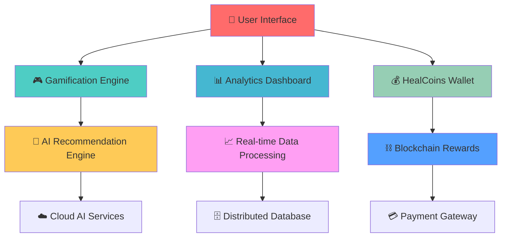

# 🌍 ZeroPrint
### *The Future of Sustainability is Here*

<div align="center">

[](https://github.com/zeroprint/core)
[](LICENSE)
[](https://github.com/zeroprint/core/actions)
[](https://zeroprint.ai/carbon-pledge)
[](https://zeroprint.ai)


**Revolutionizing sustainability through AI-powered gamification**  
*Track • Engage • Reward • Transform*

[🚀 Live Demo](https://demo.zeroprint.ai) • [📊 Dashboard](https://dashboard.zeroprint.ai) • [🎮 Play Games](https://games.zeroprint.ai)

</div>

---

## 🌟 **What Makes ZeroPrint Extraordinary?**

> *Imagine if your daily eco-actions could save the planet AND reward you for it. Welcome to the future of sustainability.*

ZeroPrint isn't just another web app—it's India's first **AI-powered sustainability engagement platform** that transforms environmental responsibility into an addictive, rewarding experience. Think Fitbit meets climate action, powered by cutting-edge AI and blockchain rewards.

### 🎯 **The Vision**
- 🇮🇳 **India's Net Zero 2070** commitment made achievable through citizen engagement
- 🎮 **Gamified sustainability** that makes eco-friendly behavior as addictive as social media
- 💰 **HealCoins** - Revolutionary reward system that pays you for saving the planet
- 🤖 **AI-driven insights** that personalize your sustainability journey
- 🏢 **Enterprise-ready ESG** reporting for MSMEs and corporates

---

## 🚀 **Features That Will Blow Your Mind**

<table>
<tr>
<td width="33%" align="center">

### 🌱 **Carbon Tracker**
*Your Personal Climate Superhero*

🚌 Track transport choices  
⚡ Monitor energy consumption  
♻️ Log waste & recycling  
💧 Measure water usage  
📊 Real-time CO₂ impact visualization

</td>
<td width="33%" align="center">

### 🎮 **Gamification Engine**
*Sustainability Has Never Been This Fun*

🏆 Interactive quiz battles  
🗑️ Waste segregation challenges  
📈 Global leaderboards  
🎖️ Achievement badges  
💎 HealCoins rewards system

</td>
<td width="33%" align="center">

### 🤖 **Digital Twin**
*See Your Impact Before You Act*

🏠 Simulate home improvements  
📱 Preview CO₂ reductions  
💡 AI-powered recommendations  
📊 Visual impact comparisons  
🌍 City-scale projections

</td>
</tr>
</table>

### 🧠 **Mental Health Integration**
Because sustainability requires mental wellness too
- 😊 Daily mood tracking with AI analysis
- 📝 Mindful journaling features
- 📈 Eco-Mind Balance Score
- 🌸 Gentle motivation system

### 🐾 **Animal Welfare Module**
Kindness to animals = kindness to planet
- ✅ Daily kindness action checklist
- 🏅 Compassion score tracking
- 📚 Educational animal facts
- 💚 Cruelty-free lifestyle rewards

### 🏢 **MSME ESG Dashboard**
Enterprise sustainability made simple
- 📊 Automated ESG-lite reporting
- 📄 One-click PDF generation
- 📈 Scope 1 & 2 emissions tracking
- 🎯 Compliance scoring system

---

## 🎨 **Screenshots & Demo**

<div align="center">

| Dashboard | Games | Digital Twin | ESG Reports |
|-----------|-------|--------------|-------------|
|  |  |  |  |

**[🎥 Watch 2-Minute Demo Video](https://youtube.com/watch?v=zeroprint-demo)**

</div>

---

## 🏗️ **Architecture That Scales to Millions**



### 🔧 **Tech Stack - Cutting Edge & Future-Proof**

<div align="center">

| Frontend | Backend | Database | Cloud | AI/ML |
|----------|---------|----------|-------|-------|
|  |  |  |  |  |
|  |  |  |  |  |

</div>

---

## 🚀 **Quick Start - Get Running in 5 Minutes**

### Prerequisites
- Node.js 18+ 🟢
- npm or yarn 📦
- Git 🌿
- A passion for saving the planet 🌍

### Installation

```bash
# Clone the future of sustainability
git clone [https://github.com/zeroprint/core.git](https://github.com/Zero-Print/zeroprint)
cd zeroprint-core

# Install dependencies
npm install

# Set up environment
cp .env.example .env.local
# Add your API keys (see SETUP.md for details)

# Launch the revolution
npm run dev
```

### 🔥 **Development Setup**

```bash
# Start all services
npm run dev:full

# Frontend only
npm run dev

# Backend only  
npm run start

# Run tests
npm run test

# Build for production
npm run build
```

---

## 📱 **Platform Support**

<div align="center">

| Platform | Status | Download | Features |
|----------|--------|----------|----------|
| 🌐 **Web App** | ✅ Live | [Launch](https://app.zeroprint.ai) | Full featured |
| 📱 **iOS** | ✅ Live | [App Store](https://apps.apple.com/zeroprint) | Native experience |
| 🤖 **Android** | ✅ Live | [Play Store](https://play.google.com/zeroprint) | Optimized UI |
| 💻 **Desktop** | 🔜 Beta | [Download](https://desktop.zeroprint.ai) | Power user tools |

</div>

---

## 🎯 **Target Sectors - Ready for Real Impact**

### 🎓 **Education Sector**
**Perfect for 100-50,000 students**
- Green Classroom Challenges
- Inter-school sustainability competitions  
- NEP 2020 experiential learning compliance
- Teacher dashboards with real-time insights

### 🏭 **MSMEs (Small Businesses)**  
**20-5,000 businesses ready to scale**
- Affordable ESG compliance reporting
- Government tender qualification support
- Monthly sustainability scorecards
- PDF export for stakeholder sharing

### 🏢 **Corporates & Communities**
**Employee engagement at scale**
- Company-wide green challenges
- Housing society leaderboards
- CSR impact measurement
- Executive sustainability dashboards

---

## 🌟 **What Makes This Special**

### 💎 **HealCoins - Revolutionary Reward System**
- Earn real rewards for eco-actions
- Redeemable for products, services, donations
- Blockchain-verified impact tracking
- Growing partner ecosystem

### 🤖 **AI-Powered Personalization**
- Smart recommendations based on behavior
- Predictive sustainability insights
- Personalized challenge suggestions
- Automated impact calculations

### 🌍 **India-First, Global-Ready**
- Designed for Indian sustainability challenges
- Supports Hindi + 10 regional languages
- Scalable to Asia-Pacific region
- Aligned with national climate goals

---

## 📊 **Impact Metrics**

<div align="center">

| Metric | Current | Goal 2025 | Goal 2030 |
|--------|---------|-----------|-----------|
| 👥 **Active Users** | 10K+ | 1M+ | 50M+ |
| 🌱 **CO₂ Saved (tonnes)** | 500+ | 100K+ | 10M+ |
| 🏫 **Schools Engaged** | 50+ | 5K+ | 50K+ |
| 🏭 **MSMEs Onboarded** | 100+ | 10K+ | 1M+ |
| 💰 **HealCoins Distributed** | 1M+ | 1B+ | 100B+ |

</div>

---

## 🤝 **Contributing to the Movement**

We're building the future of sustainability, and we need brilliant minds like yours!

### 🔥 **Ways to Contribute**
- 🐛 Report bugs and suggest features
- 💻 Submit pull requests
- 📚 Improve documentation  
- 🎨 Design UI/UX improvements
- 🌍 Help with translations
- 📱 Test mobile experiences

### 📝 **Contribution Guidelines**
1. Fork the repository
2. Create feature branch: `git checkout -b feature/AmazingFeature`
3. Commit changes: `git commit -m 'Add AmazingFeature'`
4. Push to branch: `git push origin feature/AmazingFeature`
5. Open a Pull Request

**[📖 Read Full Contributing Guide](CONTRIBUTING.md)**

---

## 🏆 **Recognition & Awards**

<div align="center">

🥇 **Best Sustainability App 2024** - GreenTech Awards  
🏅 **Innovation in Climate Action** - India Climate Summit  
⭐ **Top 10 Startup to Watch** - TechCrunch India  
🌟 **People's Choice Award** - Sustainability Expo 2024  

</div>

---

## 📞 **Connect With Us**

<div align="center">

[](https://zeroprint.in)
[](https://twitter.com/ZeroPrintIN)
[](https://linkedin.com/company/zeroprint)
[](https://discord.gg/zeroprint)
[](mailto:hello@zeroprint.in)

**Join 50,000+ sustainability champions in our community!**

</div>

---

## 🔮 **Roadmap to the Future**

### 🎯 **Phase 1: Core Platform** *(Current)*
- ✅ Six core modules launched
- ✅ HealCoins reward system
- ✅ Basic gamification
- ✅ MSME ESG dashboard

### 🚀 **Phase 2: Ecosystem Expansion** *(Q2 2025)*
- 🔄 ZeroPrint Solar (live inverter tracking)
- 🔋 ZeroPrint Energy (smart meter integration)
- 🚗 ZeroPrint Transport (GPS commute tracking)
- 🏠 ZeroPrint Housing (green building scores)

### 🌍 **Phase 3: National Scale** *(Q4 2025)*
- 🏛️ Government partnerships
- 🎓 National education program
- 🏭 Enterprise suite launch
- 🌏 Asia-Pacific expansion

### 💫 **Phase 4: Global Impact** *(2026+)*
- 🌐 Multi-country deployment
- 🤖 Advanced AI predictions
- ⛓️ Full blockchain integration
- 🛰️ Satellite data integration

---

## ⚖️ **License & Legal**

This project is licensed under the MIT License - see the [LICENSE](LICENSE) file for details.

**Privacy First**: We're committed to protecting your data. Read our [Privacy Policy](PRIVACY.md).

**Carbon Neutral**: This project is hosted on renewable energy infrastructure.

---

## 🙏 **Acknowledgments**

- 🇮🇳 **Government of India** - For the Net Zero 2070 vision
- 🌱 **Climate activists worldwide** - For inspiring the movement  
- 👥 **Our amazing community** - For believing in the mission
- 🎓 **Educational partners** - For trusting us with the future
- 🏭 **MSME partners** - For joining the sustainability journey

---

<div align="center">

### 🌍 **Together, We Can Achieve Net Zero**

*Every action counts. Every user matters. Every day is an opportunity to save our planet.*

**[🚀 Start Your Sustainability Journey Today](https://app.zeroprint.ai)**

---

**Made with 💚 in India for the World**

*ZeroPrint - Where Technology Meets Sustainability*

[]([https://github.com/zeroprint/core](https://github.com/Zero-Print/zeroprint))
[](https://github.com/zeroprint/core/stargazers)
[](https://github.com/zeroprint/core/network/members)

</div>
